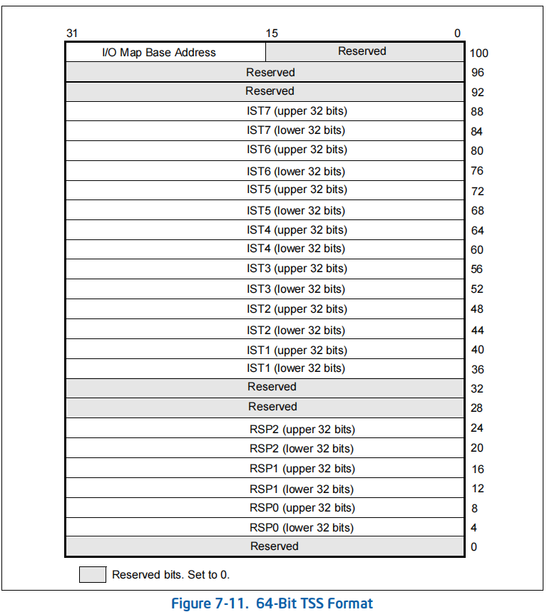

## 长模式段描述符

* 长模式下，CPU 不在对段基址和段长度进行检测，只对 DPL 进行相关检查；
* L = 1，D/B = 0 时，表示 64 位代码段描述符；
* 如果是数据段，则 G、D/B、L 都无效；

> GDT（全局描述符表）中有以下种类描述符：
>
> * 代码段描述符；
> * 数据段描述符；
> * TSS 描述符；

## 长模式中断描述符

* IST：指 64 位 TSS 中的 IST 指针
* 常用**属性**
  * 8E：权限级别为 0 的中断门
  * 8F：权限级别为 0 的陷阱门
  * EE：权限级别为 3 的中断门
  * EF：权限级别为 3 的陷阱门

>  IDT（中断描述符表）有以下几种描述符：
>
> * 中断门描述符；
> * 陷阱门描述符；
> * ~~任务门描述符~~（长模式下已不支持硬件任务切换，所以已经没有该描述符）；

## TSS

64 位 TSS 段主要功能为栈的切换提供各种特权级的栈指针。

* 64 位处理器删除了硬件任务切换；

* 只保留了三个特权级的 RSP 指针；SS 在 TSS 中没有位置，CPU 将 SS 设置成 0；
* IST：中断堆栈表的指针地址；