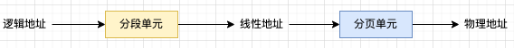
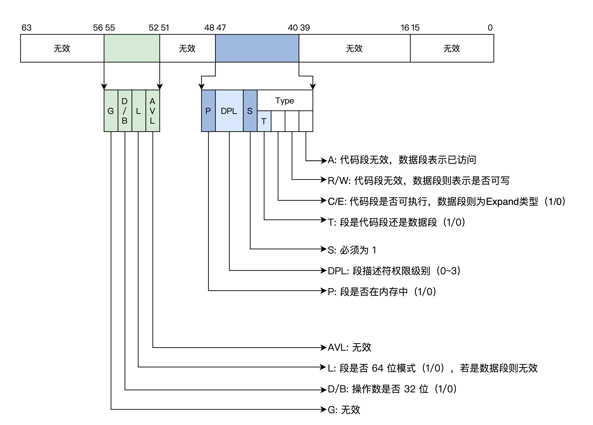
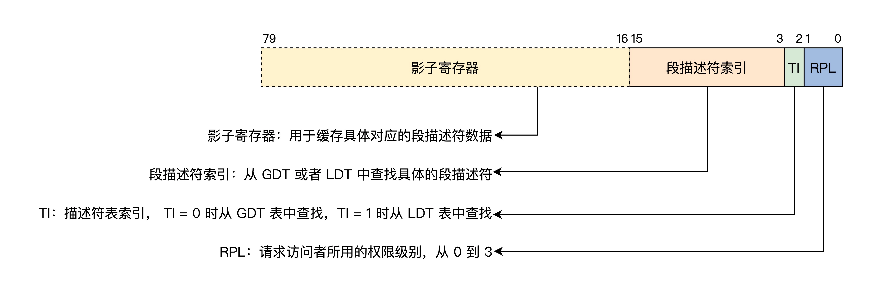
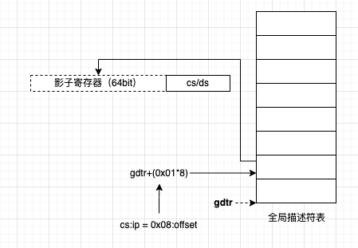
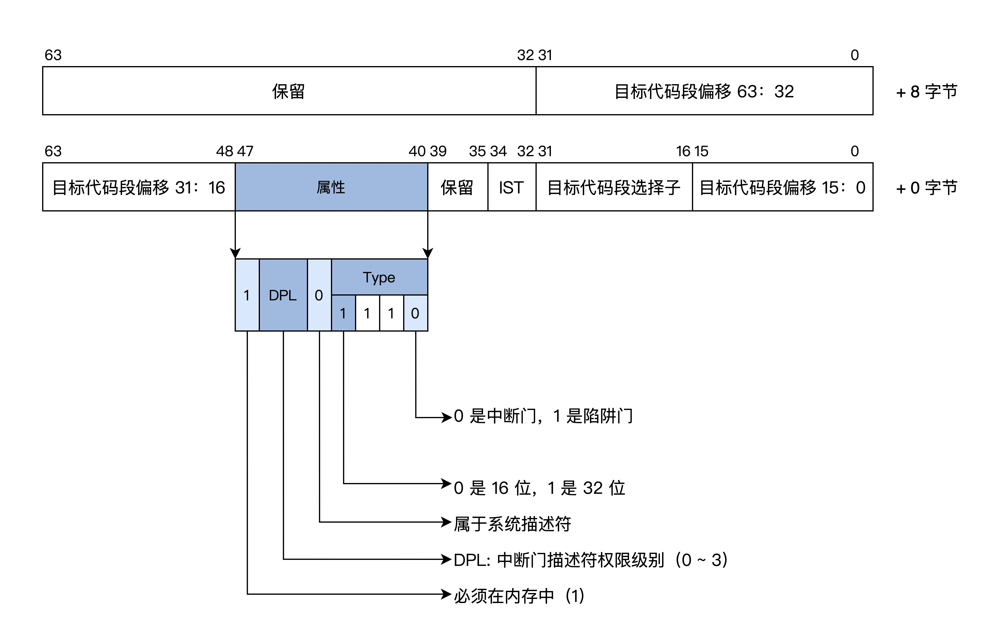

## 内存地址

* 逻辑地址：程序代码指令中的地址，可以认为是虚拟地址；
* 线性地址：逻辑地址经过分段计算后得到。在现代 x86-64 位操作系统中，线性地址和逻辑地址是一样的；
* 物理地址：线性地址经过 MMU 后，得到物理上真正地址；

## 分段

段描述符：用于描述一个段的信息。在长模式下，其格式是：

在操作系统中，多个段描述符组成一个描述符表。通过 gdtr（全局描述符寄存器）指向表的基地址。

> 还有一个 ldtr（局部描述符寄存器），现代操作系统都是通过分页来管理内存，分段处理只是为了兼容，ldtr 用的比较少，所以也不讨论 ldtr。

段选择子：通过段选择子可以确定该使用哪个段描述符：

通过分段来计算线性地址流程：

同理，在长模式下中断门描述符格式：

